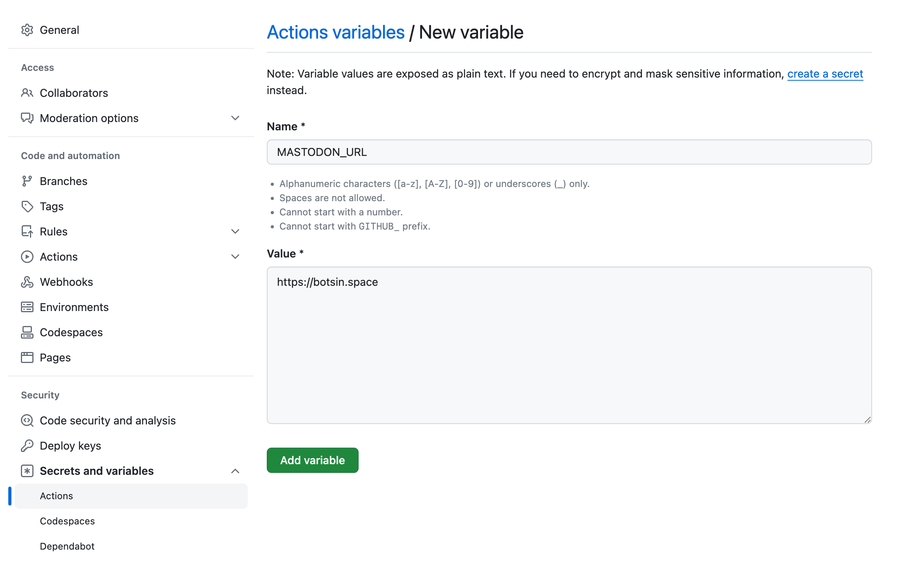
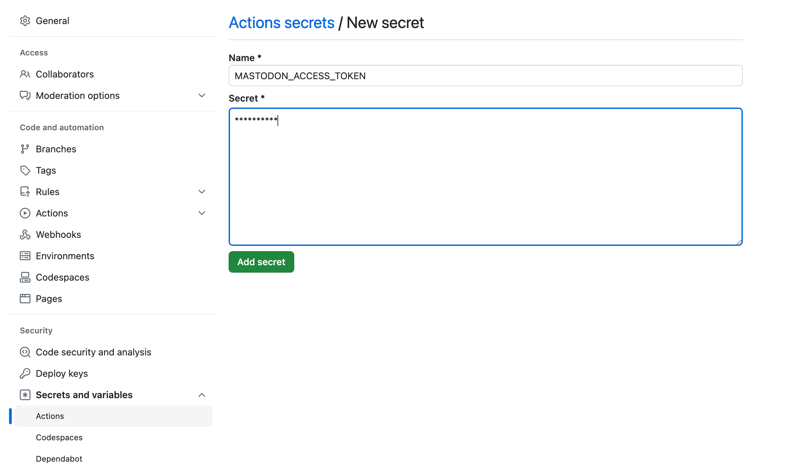

# FlyBy P5 Bot

## Setup

```
npm install
```

## Running Locally

This repo uses the creating coding tool [canvas-sketch](https://github.com/mattdesl/canvas-sketch)
by the artist [Matt DesLauriers](https://mattdesl.com/) with the `p5` integration.

### Run in browser:
```
npx canvas-sketch-cli sketches/sketch.js
```
This will start a server with a live-reloading sketch that can be opened in your browser locally.

### Save a high-res image via Node.js

To be able to run p5 in Node.js (where there is no browser or canvas), we use the library [p5.node](https://github.com/ericrav/p5.node).

To export the image, run:
```
node sketches/export.js
```

### Post images to Mastodon

Mastodon is an open-source, decentralized social network like Twitter that allows automated accounts (bots) to post.

To create your own Mastodon bot, create an account on a Mastodon instance like https://botsin.space/ (DM me for an invite code).

Once you have an account, go to Settings > Development (https://botsin.space/settings/applications) and create a new developer application.
Then, copy the access token it generates for you.

Create a `.env` file in the root of this repo with the following contents (& paste in your access token):

```
MASTODON_URL=https://botsin.space
MASTODON_ACCESS_TOKEN=
```

After an image has been exported to `output.png`, run this command to post it to your Mastodon account:
```
node mastodon.js
```

Then checkout the link to your post!

## GitHub Actions

Once you've pushed your repo to GitHub, you can setup a GitHub Action to run every time you push your code.

Before your GitHub action will work, we need to add the environment variables that are hidden in the repo.
Navigate to your repo's settings, then click "Secrets and variables" > Actions.

Then, click the Variables tab and click "New repository secret". Enter the `MASTODON_URL` value from your .env file.



Next, click the Secrets tab and click "New repository secret". Enter the `MASTODON_ACCESS_TOKEN` value from your .env file.



(Unlike the variables, secrets are hidden from the logs of your GitHub Actions.)

GitHub Actions are defined in the  `.github/workflows` folder. This repo has a `mastodon.yml` workflow that runs the 2 node scripts from above.
